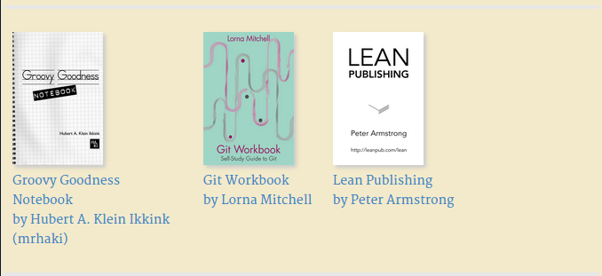

# Leanpub Affiliate Links for GitBook

This plugin allows you to add Leanpub affiliate links
to the bottom of every page in your gitbook.



## Installation

Install as a global NodeJs package.

```
$ npm install -g gitbook-plugin-leanpub-affiliate
```

## Use in a gitbook

To use in your book, add to plugins list in `book.json` in your gitbook directory:

```json
{
    "plugins": ["leanpub-affiliate"]
}
```

## Configuration

You can configure the plugin is `book.json`:

```json
{
    "pluginsConfig": {
        "leanpubAffiliate": {
            "queryString": {
                "a": "27hVMyWVn46xaZCi6E563X",
                "subID": "gitbookPlugin"
            },
            "image": {
                "display": true,
                "width": 102,
                "height": 150
            },
            "count": 3,
            "total": 50,
            "links": [
                {
                    "id":21391,
                    "title":"AngularJs vs EmberJs",
                    "author_string":"Brendan Graetz",
                    "url":"http://leanpub.com/angularjs-emberjs-compare",
                    "image":"https://s3.amazonaws.com/titlepages.leanpub.com/angularjs-emberjs-compare/medium?1416295405"
                }
            ]
        }
    }
}
```

* `queryString`
    * Gets suffixed to every affiliate link
    * For example, the above config means that `?a=27hVMyWVn46xaZCi6E563X&subID=gitbookPlugin` will get added to very link
* `image`
    * Whether or not images should be displayed, and their dimensions
* `count`
    * The number of affiliate links to display per page
* `total`
    * Not all links will be picked for display, by default, just twice of the count per page
    * Specify the total number of links to randomly select for display across all pages in the gitbook
* `links`
    * An array of links that should always be included
    * Use these for your favourite books

## Styling

The appearance of the list of Leanpub affiliate links at the bottom of each page is rudimentary.
Please add CSS styles to the theme you are using to achieve the intended styling effect.
See `book/plugin.css` for an example.

## Notes

If you experience problems with the plugin not having any effect at all,
i.e. the links do not appear at the bottom of each page,
please check your `book.json` file.
If gitbook fails to parse that file, it will silently fail,
rendering all the pages without any plugins or themes.
This affects all gitbook plugins, not just this one.

## Licence

GPLv3

## Requests

Contributions welcome, of course!
